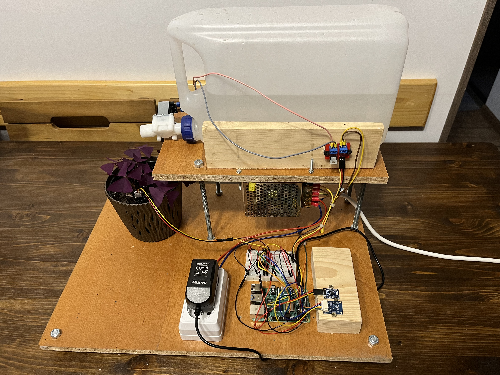
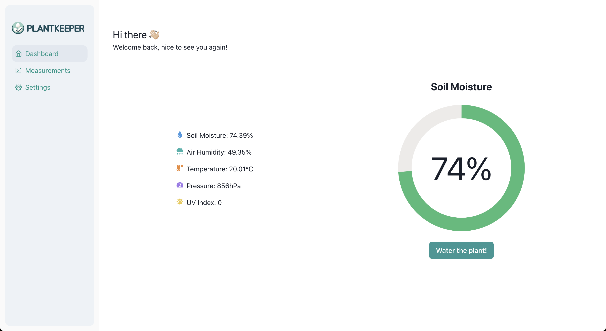
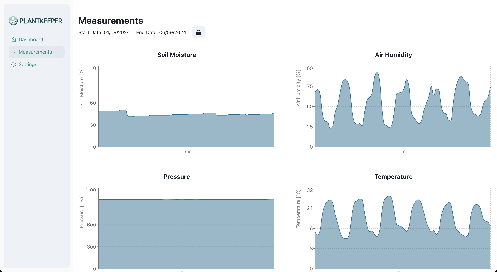
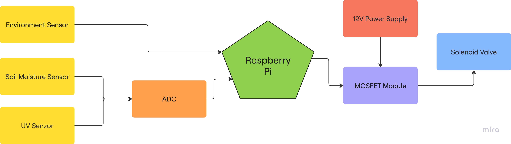
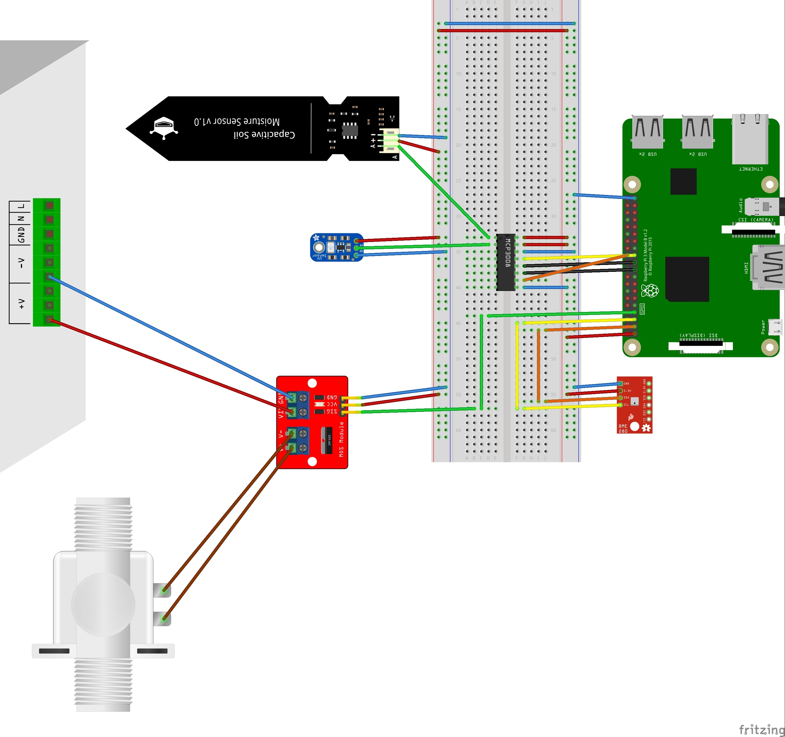

# Plantkeeper - Automated Irrigation System







# Table of Contents
1. [Project Description](#project-description)
2. [Features](#features)
3. [Hardware Components](#hardware-components)
4. [Software Components](#software-components)
5. [System Architecture](#system-architecture)
6. [Wiring Diagram](#wiring-diagram)
7. [Installation and Setup](#installation-and-setup)
8. [Access the Application](#access-the-application)
9. [Acknowledgments](#acknowledgments)
10. [License](#license)

## Project Description
This project implements an automated irrigation system designed to optimize water usage for plant care using a Raspberry Pi. By integrating various environmental sensors, the system monitors conditions such as soil moisture, air humidity, temperature, pressure, and UV index, and adjusts the watering schedule accordingly.

## Features
- Real-time monitoring of environmental conditions.
- Automated irrigation based on soil moisture levels.
- User-friendly web interface for manual control and data visualization.
- Data logging and trend analysis to optimize water usage.

## Hardware Components
- Raspberry Pi 4 Model B - Central controller.
- Sensors:
    - Environment Sensor (Pressure, Temperature, Humidity) (BME280)
    - Capacitive Soil Moisture Sensor
    - UV Sensor (GUVA-S12SD)
- MCP3008 ADC for analog-to-digital signal conversion.
- 12V Solenoid Valve with MOSFET module for water control.
- 12V Power Supply
- MOSFET module (IRF520) 
- Additional components: Breadboard, jumper wires, and wood frame.

## Software Components
This project is based on the [Full Stack FastAPI Template](https://github.com/fastapi/full-stack-fastapi-template) 
- [FastAPI](https://fastapi.tiangolo.com) for the Python backend API.
- [PostgreSQL](https://www.postgresql.org) as the SQL database.
- [React](https://react.dev) for the frontend.
- [Docker Compose](https://www.docker.com) for development and production.

## System Architecture


## Wiring Diagram


## Installation and Setup

### Prerequisites
Before setting up the automated irrigation system, ensure that the following prerequisites are met:
- [Raspberry Pi OS](https://www.raspberrypi.com/software/) is installed
- I2C and SPI are enabled using [raspi-config](https://www.raspberrypi.com/documentation/computers/configuration.htmlhttps://www.raspberrypi.com/documentation/computers/configuration.html) 
- SSH is enabled (only if you plan to connect to the Raspberry Pi remotely)
- Docker, can be installed from [here](https://docs.docker.com/engine/install/debian/)

### Setup Instructions
1. Clone the Repository:
```bash
git clone https://github.com/airdgo/plantkeeper.git
cd plantkeeper
```
2. Configure the Environment:
- If necessary, customize environment variables (e.g., database settings) by editing the .env file in the project directory.
3. Run the Application:
- Use Docker Compose to start the application:
```bash
docker compose up
```
- This command will pull necessary images, build the containers, and start the backend, database, and frontend.

## Access the Application
Once the application is running, access the web interface by navigating to http://dev.plantkeeper.com in your web browser from the Raspberry Pi.

If you want to access the application from a different computer you need to open your `hosts` file on that computer with administrative privileges using a text editor:

* **Note for Windows**: If you are in Windows, open the main Windows menu, search for "notepad", right click on it, and select the option "open as Administrator" or similar. Then click the "File" menu, "Open file", go to the directory `c:\Windows\System32\Drivers\etc\`, select the option to show "All files" instead of only "Text (.txt) files", and open the `hosts` file.
* **Note for Mac and Linux**: Your `hosts` file is probably located at `/etc/hosts`, you can edit it in a terminal running `sudo nano /etc/hosts`.

* Additional to the contents it might have, add a new line with the Raspberry Pi IP (e.g. `192.168.99.150`) a space character, and the fake local domain: `dev.plantkeeper.com`.

The new line might look like:

```
192.168.99.150    dev.plantkeeper.com
```

* Save the file.
  * **Note for Windows**: Make sure you save the file as "All files", without an extension of `.txt`. By default, Windows tries to add the extension. Make sure the file is saved as is, without extension.

...that will make your computer think that the fake local domain is served by that custom IP, and when you open that URL in your browser, it will talk directly to your locally running server when it is asked to go to `dev.plantkeeper.com` and think that it is a remote server while it is actually running in your computer.

# Acknowledgments
- Special thanks to the open-source community and libraries that made this project possible.
- Template for the application provided by Tiangolo’s [Full Stack FastAPI Template](https://github.com/fastapi/full-stack-fastapi-template)

# License
This project is licensed under the MIT License.
